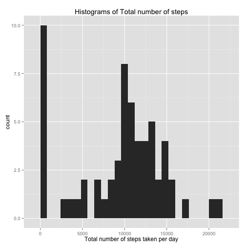
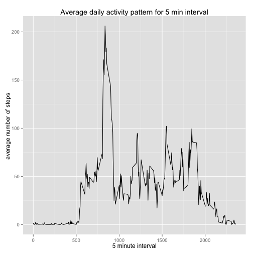
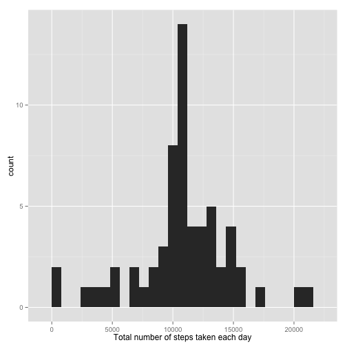
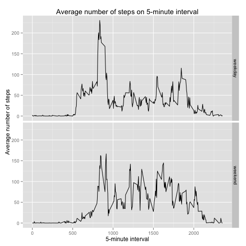

R markdown written for Reproducible reaserach assignment 1

# Peer Assignment 1

### 1. Read data into R


```r
activity<-read.table("./activity.csv", sep=",", header=TRUE)
head(activity)
```

```
##   steps       date interval
## 1    NA 2012-10-01        0
## 2    NA 2012-10-01        5
## 3    NA 2012-10-01       10
## 4    NA 2012-10-01       15
## 5    NA 2012-10-01       20
## 6    NA 2012-10-01       25
```

Next let us plot histogram of total steps taken per day

### 1. Histogram od steps per day


```r
library(ggplot2)
Tsteps <- tapply(activity$steps, activity$date, FUN=sum, na.rm=TRUE)
qplot(Tsteps, binwidth=800, xlab="Total number of steps taken per day", main="Histograms of Total number of steps")
```

 

### 2. Mean and Median of Steps

```r
mean(Tsteps, na.rm=TRUE)
```

```
## [1] 9354
```

```r
median(Tsteps, na.rm=TRUE)
```

```
## [1] 10395
```

## Average activity pattern 

### 1. Average daily activity pattern


```r
library(ggplot2)
average<- aggregate(x=list(s=activity$steps), by=list(i=activity$interval), FUN=mean, na.rm=TRUE)
ggplot(data=average, aes(x=i, y=s)) +
        geom_line() +
        xlab("5 minute interval") +
        ylab("average number of steps ") + 
        ggtitle("Average daily activity pattern for 5 min interval")
```

 

### 2. The maximum average number of steps taken on 

```r
average[which.max(average$s),]
```

```
##       i     s
## 104 835 206.2
```

## Imputting missing values

### 1. Total # of missing values

```r
missing <- is.na(activity$steps)
# Number of missing values Table
table(missing)
```

```
## missing
## FALSE  TRUE 
## 15264  2304
```


Missing values will be filled in with mean value for that 5-minute
interval.


```r
# Replace each missing value with the mean value of its 5-minute interval
fill <- function(s, i) {
        filled <- NA
        if (!is.na(s))
                filled <- c(s)
        else
                filled <- (average[average$i==i, "s"])
        return(filled)
        }
# make a new data set form the activity data set and substitute the missing values
new_activity <- activity
new_activity$steps <- mapply(fill, new_activity$steps, new_activity$interval)
head(new_activity)
```

```
##     steps       date interval
## 1 1.71698 2012-10-01        0
## 2 0.33962 2012-10-01        5
## 3 0.13208 2012-10-01       10
## 4 0.15094 2012-10-01       15
## 5 0.07547 2012-10-01       20
## 6 2.09434 2012-10-01       25
```

### Histogram of total number of steps taken each day


```r
total.steps <- tapply(new_activity$steps, new_activity$date, FUN=sum)
qplot(total.steps, binwidth=800, xlab="Total number of steps taken each day")
```

 

```r
mean(total.steps)
```

```
## [1] 10766
```

```r
median(total.steps)
```

```
## [1] 10766
```
The mean and median of the current data set is diffrent from the origional data set. Both mean and median are higher. For any NA score values, on the previous analysis the values were set to zero. But now when we replace the NA values with the mean values of each interval, the mean and median of the intervals tend to be higher. 


## Activity paterns

### 1. Create a new factor variable


```r
week <- function(date) {
        day <- weekdays(date)
        if (day %in% c("Monday", "Tuesday", "Wednesday", "Thursday", "Friday"))
                return("weekday")
        else if (day %in% c("Saturday", "Sunday"))
                return("weekend")
        else
                stop("invalid date")
        }
new_activity$date <- as.Date(new_activity$date)
new_activity$day <- sapply(new_activity$date, FUN=week)
## tabulate the day variable
table(new_activity$day)
```

```
## 
## weekday weekend 
##   12960    4608
```
### 2. make panel plot of 5-minuite interval averaged over weekdays or weekends


```r
averages <- aggregate(steps ~ interval + day, data=new_activity, mean)
ggplot(averages, aes(interval, steps)) + geom_line() + facet_grid(day ~ .) +
        xlab("5-minute interval") + ylab("Average number of steps") + ggtitle("Average number of steps on 5-minute interval")
```

 


